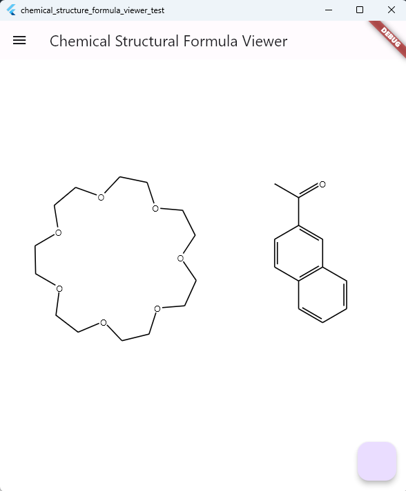

# chemical_structure_formula_viewer
A flutter package to display chemical structure formulas.


## Features

It supports CDXML, CML.
Now, it's not beautiful, just a simple display.



## Getting started

Just add the package to your `pubspec.yaml` file:

```yaml
dependencies:
  chemical_structure_formula_viewer: ^0.0.1
```

Then run `flutter pub get` to install the package.

## Usage

```dart

class StructureViewer extends StatelessWidget {
    StructurePage? page;
    void load() {
        var xml = '';// load your xml here
        page = parseCml(xml);
        // or
        // page = parseCdxml(xml);
        setState(() {});
    }

    @override
    Widget build(BuildContext context) {
        return Scaffold(
        appBar: AppBar(
            title: const Text('Chemical Structural Formula Viewer'),
        ),
        body: StructureViewer(
            page: page,   
        ),
        floatingActionButton: FloatingActionButton(onPressed: load),
        );
    }
}
```


